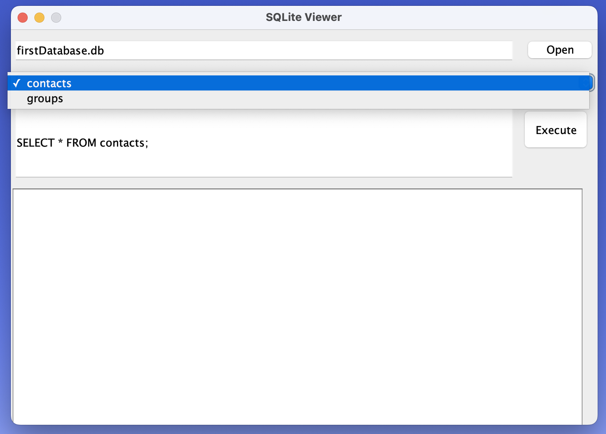
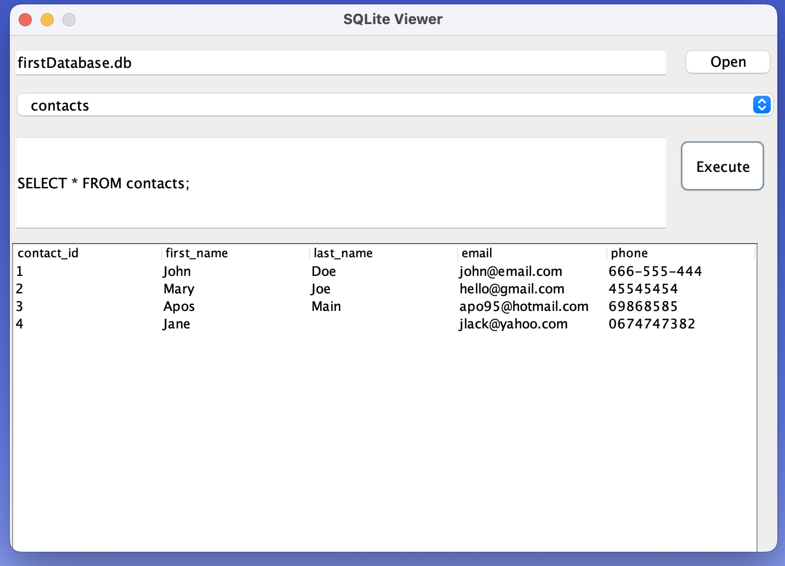

# SQLite-Viewer
A swing SQLite database viewer ,using to read two distict database file=firstDatabase.db
secondDatabase.db
extracting the data from the SQL database and presenting with an GUI using the Swing Framewoek in Java

